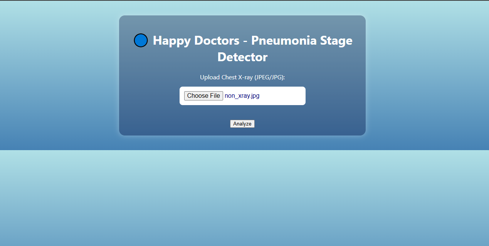

# Happy Doctors

This project is a web-based tool for **analyzing chest X-ray images** to detect pneumonia and identify its specific stage.

---

## 🖥️ Landing Page

Here's what the landing page looks like:

---

## 📤 How to Use the App

### 1. Upload an X-ray Image

Click the **"Choose File"** button to attach your chest X-ray image. You'll be prompted to select a file from your device.

Once you've uploaded the image, it will appear like this:

---

### 2. Analyze the Image

Click the **"Analyze"** button. The system will then check the image and give one of the following responses:

---

### 📸 Sample Outputs

- ❌ **Not a chest X-ray**
  
  If the uploaded image is not a chest X-ray:

  

---

- ✅ **Normal chest X-ray**

  If it's a chest X-ray from a person *without pneumonia*:

  

---

- ⚠️ **Pneumonia Detected - Stage Identified**

  If it's a chest X-ray of a person *with pneumonia*, the system will detect the **specific stage** (e.g., red hepatization):

  

---

## 🚀 Deployment Status

Currently working on making the application public and accessible online. Deployment strategies are in progress.

---

